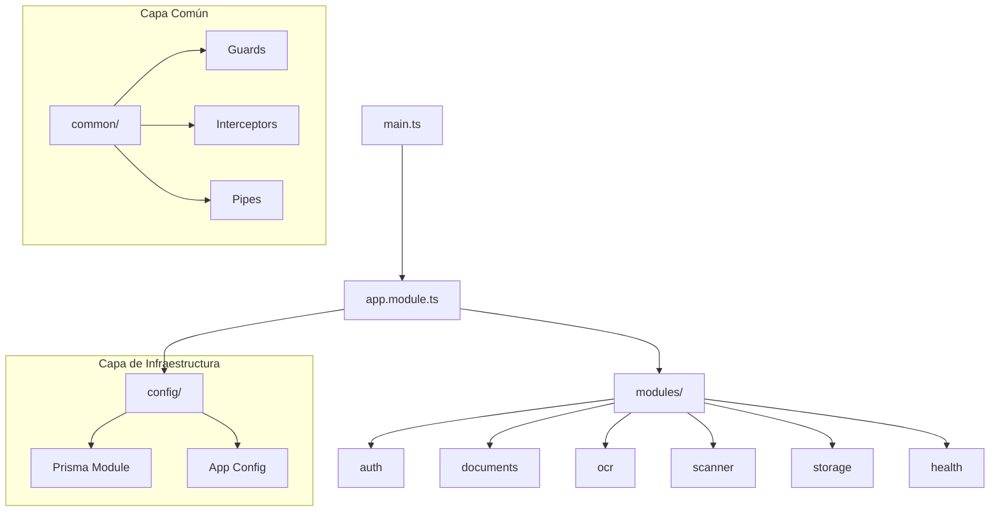

# DocScan Backend - NestJS API

API robusta y escalable construida con **NestJS**, diseñada para la gestión inteligente de documentos, procesamiento OCR y automatización de escaneo.

## 🚀 Stack Tecnológico

- **Framework**: [NestJS 10](https://nestjs.com/) (Modular Monolith)
- **Lenguaje**: TypeScript 5.3+
- **ORM**: [Prisma](https://www.prisma.io/)
- **Base de Datos**: PostgreSQL (via Prisma)
- **Seguridad**: Passport.js + JWT (JSON Web Tokens)
- **IA/OCR**: 
  - Google GenAI (@google/genai) para análisis semántico.
  - Tesseract.js para reconocimiento óptico de caracteres local.
- **Procesamiento de Imágenes**: Sharp
- **Gestión de Paquetes**: pnpm

---

## 🏗️ Arquitectura del Sistema (`src/`)

El proyecto sigue una arquitectura modular y orientada a servicios, manteniendo una clara separación de responsabilidades.



### Carpetas Principales

- **`common/`**: Lógica compartida por toda la aplicación.
  - `guards/`: Protectores de rutas (ej. `JwtAuthGuard`).
  - `filters/`: Manejo global de excepciones.
  - `interceptors/`: Transformación de respuestas y logging.
  - `pipes/`: Validación y transformación de datos (DIP/SRP).
  - `decorators/`: Decoradores personalizados para clean code.

- **`config/`**: Configuración centralizada.
  - `prisma.module.ts`: Integración con el ORM Prisma.
  - `app.config.ts`: Variables de entorno y constantes globales.
  - `ocr.config.ts`: Configuración para Google GenAI y motores de OCR.

- **`modules/`**: El núcleo de la lógica de negocio.
  - **`auth/`**: Autenticación, login, registro y estrategias de JWT.
  - **`documents/`**: CRUD de documentos, manejo de metadatos y repositorios personalizados.
  - **`ocr/`**: Orquestación de servicios de extracción de texto.
  - **`scanner/`**: Lógica de integración para dispositivos y flujos de escaneo.
  - **`storage/`**: Servicio de abstracción para el guardado de archivos (local/uploads).
  - **`health/`**: Endpoints de monitoreo (Health Checks).

---

## 🛠️ Desarrollo y Configuración

### Prerrequisitos
- Node.js (v20+)
- pnpm (`npm i -g pnpm`)
- PostgreSQL

### Instalación
```powershell
pnpm install
```

### Configuración
Copia el archivo `.env.example` a `.env` y configura las variables necesarias:
```powershell
cp .env.example .env
```

### Base de Datos
Genera el cliente de Prisma y ejecuta las migraciones:
```powershell
pnpm prisma:generate
pnpm prisma:migrate
```

### Ejecución
```powershell
# Desarrollo
pnpm start:dev

# Producción
pnpm build
pnpm start:prod
```

---

## 📜 Scripts Disponibles

| Comando | Descripción |
|---|---|
| `pnpm build` | Compila el proyecto a JavaScript (.dist) |
| `pnpm start:dev` | Ejecuta el servidor en modo watch |
| `pnpm prisma:migrate` | Aplica migraciones a la base de datos |
| `pnpm lint` | Ejecuta ESLint para mantener la calidad del código |
| `pnpm format` | Formatea el código con Prettier |

---

## 🛡️ Estándares de Calidad
- **Type Safety**: Uso estricto de TypeScript. `any` está prohibido.
- **Validación**: DTOs validados con `class-validator`.
- **Clean Code**: Seguimiento de los principios SOLID.
